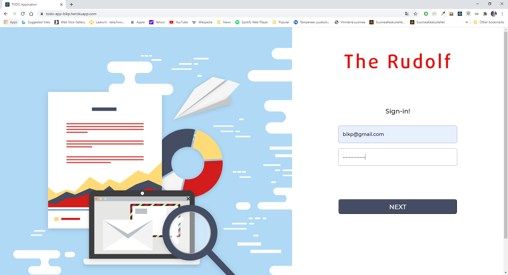
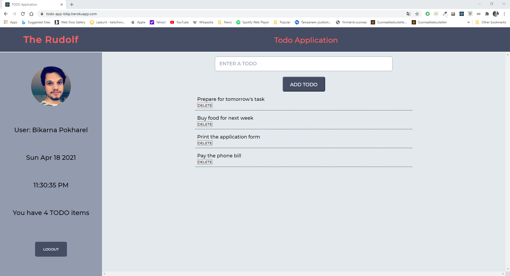

# User Login Enabled TODO Application

## Description
A user can access a TODO Applcation by providing login credentials - _email (as username) and password_. It is assumed that the user has been registered by the administrator of the application. After a successful login, the user sees an interface to add todo items. The first time the user logins into the application, the todo list is empty, however, if the user had previously entered some todo items, they will appear as a list with the possibility to delete a todo as required. Additionally, the UI shows the user's profile picture, name of the user, current local date and time, and the total number of todo items that belong to the user. There is a Logout button to logout of the application. 

### The running app is available at [Todo-App](http://todo-app-bikp.herokuapp.com/)
__Use the credentials provided below, [Click-here](#test-user-credentials), to login to the app__

## Getting started
Open a terminal (or a shell) and navigate to a location of your choice. Then issue the following command to clone the repository:
#### `git clone https://gitlab.com/bikarnap/todo-application-with-login.git`

## Start the backend server
After cloning the repository as mentioned above, run the following commands
##### `cd todo-application-with-login`
##### `cd todo-app-backend`
##### `npm install`
##### `npm start`
The server will start listening on port 3002. 
```
Note: Make sure that the port 3002 is not being used by other services.
```

## Start the frontend 
Open a new terminal (or a shell), and navigate to the the _todo-application-with-login_ folder that was cloned previously. Then issue the following commands.
##### `cd todo-app`
##### `npm install`
##### `npm start`

After this, the frontend app should automatically launch on the browswer at 
##### `localhost:3000`
In case, the app does not launch automatically, it can be manually launched on your browser by entering
##### `localhost:3000`
```
Note: Make sure that the port 3000 is not being used by other services.
```

#### Test user credentials
1. `username/email: bikp@gmail.com, password: bikarnapokharel`
2. `username/email: tim@gmail.com, password: timjackson`
3. `username/email: rudolf@gmail.com, password: rudolftampere`

### Note: credentials and environment variables should not generally be shared publicly. It is done here only for the purpose of demonstration


## Screenshots of running application

#### Login Page 1


### Login Page 2


#### Todo App Page 1


#### Todo App Page 2


## REST APIs
* GET users: `http://localhost:3002/api/users/`
* GET todos: `http://localhost:3002/api/todos/`

## Tools used during development
* The frontend was bootstraped with [Create React App](https://github.com/facebook/create-react-app)
* The backend was created as an `npm` project
* IDE used: `Visual Studio Code`
* Version Control using `git`
* Database: `MongoDB Atlas cloud`
* `REST client` in Visual Studio Code for performing HTTP actions

## Dependencies Used
* `express` for backend/api server
* `axios` for fetching data from the backend/api
* `mongoose` for mongoDB
* `cors`for allowing cross-origin in the backend server
* `dotenv` for environment variables 
* `bcrypt` for password hashing
* `jsonwebtoken` for user token authentication 

## Development Dependencies Used
* `cross-env` for cross-platform environment
* `nodemon` for reloading the devlopment backend server
* `jest` for testing
* `supertest` for testing the API
